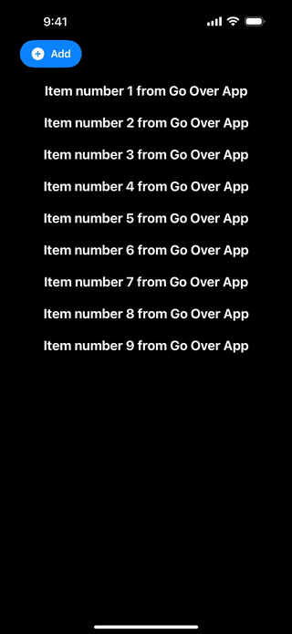

# CustomNavigationBar for SwiftUI
A lightweight, customizable NavigationBar component built for SwiftUI apps.  
It supports dynamic blur backgrounds, transparency toggles, safe area handling, and smooth scrolling effects — all without using UIKit navigation components.

## ✨ Features  
- Dynamic blur effect with real-time updates  
- Smooth scroll-based offset handling  
- Supports transparent or solid backgrounds  
- Adjustable height and safe area management  
- Fully customizable content via @ViewBuilder  
- SwiftUI architecture  

## 🛠️ Built With  
- SwiftUI  
- Combine  
- UIKit (for minimal blur layer control)
    
## 📱 iPhone Screen Recording Example

## Go Over App

    
    
    
